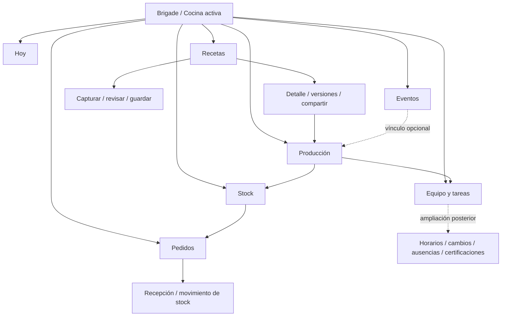

# Brigade — propuesta de diseño 01

**Referencia histórica.** La navegación lateral/superior y la adaptación móvil de esta propuesta fueron reemplazadas por la [revisión 02](DISENO_REVISION_02.md), a pedido del usuario. La preferencia tipográfica se conserva.

Estado: propuesta para revisión; pendiente de elección y aprobación del dueño del producto. Fecha: 30 de septiembre de 2026. El prototipo es una simulación visual independiente de la aplicación.

## Decisión que se propone

Recomiendo **Pase**: una interfaz oscura, con superficies verde carbón, acento lima y trabajo de cocina visible desde el inicio. La receta mantiene carácter propio con Cormorant Garamond itálica; las cantidades, acciones y etiquetas usan DM Sans. El criterio es que el chef pueda identificar qué se está haciendo, quién lo hace y qué impide terminarlo.

**Cuaderno** es la alternativa: carbón cálido, cobre, navegación horizontal y una composición editorial con una preparación protagonista y el resto como índice. Da mayor presencia al recetario y a la identidad culinaria. Puede funcionar para una cocina pequeña, pero Pase facilita comparar trabajo simultáneo. Ambas direcciones son revisables; desarrollar Pase en el prototipo no implica que haya sido elegida por el usuario.

| Decisión | Pase, recomendada | Cuaderno, alternativa |
| --- | --- | --- |
| Composición | Navegación lateral, producción y pendientes en paralelo | Navegación superior, una preparación protagonista e índice debajo |
| Foco inicial | Trabajo simultáneo y bloqueos del servicio | Receta de trabajo y continuidad de lectura |
| Superficies | Verde carbón, esquinas suaves de 14 px | Carbón cálido, esquinas de 4 px |
| Acento | Lima `#D4F478` | Cobre claro `#EFB789` |
| Platos | Serif itálica integrada en tarjetas operativas | Serif itálica más grande y protagonista |
| Interacción | Entrar directamente en producción, faltantes o captura | Continuar la preparación destacada o elegir una del índice |

## Arquitectura de información



**Hoy** reúne la jornada activa, próximos pases, preparaciones, tareas y faltantes. Es el punto de retorno después de registrar trabajo. **Recetas** guarda el conocimiento personal y compartido; una receta no pertenece necesariamente a un evento. **Producción** contiene cantidades, tandas, responsables y avance real. **Stock** y **Pedidos** son secciones independientes enlazadas desde los faltantes. **Equipo** reúne personas y tareas; podrá crecer para incorporar los horarios más adelante. **Eventos** está presente desde el primer día como contexto opcional.

| Superficie | Navegación | Organización del contenido |
| --- | --- | --- |
| Escritorio | Barra lateral con los siete módulos; cocina y sincronización arriba | Trabajo y atención pendiente en paralelo; fuente y revisión lado a lado |
| Tablet | Misma jerarquía, barra lateral compacta; una o dos columnas según espacio | Controles táctiles amplios; tabla de cantidades con encabezados estables |
| Móvil | Hoy, Recetas, Producción, Tareas, Más | Una columna; Más contiene Stock, Pedidos, Equipo, Eventos y Conexión según permisos |

En el prototipo embebido, la navegación móvil aparece al final del contenido para evitar superposición con los controles del visor. En la aplicación aprobada se propone una barra inferior persistente con espacio reservado, respeto de safe areas y sin tapar formularios ni el teclado.

## Roles y visibilidad

La estructura visual es común. El contexto de usuario cambia las acciones disponibles y la jornada inicial. Chef: visión de cocina y equipo. Sous chef: producción y preparación de compras según permiso. Commis: sus tareas, recetas autorizadas y registro de producción. La biblioteca debe distinguir siempre **propia / compartida / privada**; cambiar el rol de cocina no transfiere la propiedad de una receta.

La matriz de permisos sigue siendo una definición previa a la implementación. El selector de rol del visor sirve para revisar el diseño; no es una función para que un empleado cambie sus permisos. La API tendrá que validar cada operación independientemente de lo que muestre la interfaz.

## Sistema visual propuesto para Pase

| Token | Valor | Uso |
| --- | --- | --- |
| Fondo | `#111512` | Superficie de trabajo |
| Superficie | `#1B211C` | Preparaciones, formularios y grupos de datos |
| Superficie elevada | `#242C25` | Acciones secundarias y estados neutros |
| Borde estructural | `#39433A` | Separación de secciones |
| Texto principal | `#F3F5EB` | Cantidades, nombres y acciones |
| Texto secundario | `#B4BFB3` | Contexto, responsables, última actualización |
| Acento | `#D4F478` | Acción principal, navegación activa y progreso |
| Texto sobre acento | `#18210E` | Botones y navegación activa |
| Atención | `#F3C277` sobre `#3A3021` | Dudas, faltantes y espera de sincronización |
| Confirmado | `#A8DDBD` sobre `#233B2C` | Disponible, revisado, completo |
| En marcha | `#AACDF4` sobre `#25323E` | Producción activa |
| Error | `#FFA99B` sobre `#422B26` | Error que requiere acción |

DM Sans: cuerpo de 16 px, instrucciones operativas de 16–18 px, títulos de sección de 20 px, título de página de 34–38 px. Cormorant Garamond itálica: nombres de platos de 32–48 px; no se usa para unidades ni formularios. Cantidades: 25–40 px y cifras tabulares. Las etiquetas de contexto pueden ser de 12–14 px, sin alojar en ellas instrucciones indispensables. Inputs de al menos 16 px en móvil. La implementación debe permitir zoom de texto al 200%.

Espaciado: escala 4, 8, 12, 16, 24 y 32 px. Controles principales de al menos 46–48 px; etiquetas asociadas amplían el área de checkbox. Foco de teclado visible. Iconos lineales Lucide con etiqueta visible para acciones; nunca una acción crítica identificada solamente por un icono. Transiciones breves para cambios de progreso, compatibles con reducción de movimiento.

El color siempre acompaña una palabra: «Faltante», «En marcha», «Guardado aquí», «Pendiente», «Confirmado». La sincronización ocupa un lugar estable y permite abrir el detalle de operaciones; un punto verde aislado no alcanza.

## Wireframes de los seis flujos

Los esquemas fijan jerarquía y orden; las pantallas navegables muestran la propuesta de alta fidelidad.

### 1. Inicio de jornada

```text
┌ Cocina activa ───────────────── Estado de sincronización ┐
│ Fecha / Hoy                         Capturar receta      │
│ Trabajo del día                       Próximo pase       │
├ Producciones ──────────────────┬ Antes del pase ─────────┤
│ Plato / responsable / hora     │ Faltantes → Pedidos     │
│ Previsto / producido / abrir   │ Captura → Revisar       │
│ Siguiente preparación          │ Tareas y responsables   │
└────────────────────────────────┴─────────────────────────┘
Commis: tareas propias arriba, acceso a receta y registro debajo.
```

### 2. Captura y revisión culinaria

```text
┌ Capturar receta / número de dudas ───────────────────────┐
│ Añadir imágenes / fuente / ingreso manual                │
├ Fuente original ──────────────┬ Borrador privado ────────┤
│ Imagen o varias páginas       │ Nombre e ingredientes   │
│ Texto extraído editable       │ Fuente de cada duda     │
│ «2 kg cebolla y sal»          │ ¿Cuándo agregás la sal? │
│                              │ ¿Peso bruto o neto?     │
├──────────────────────────────┴──────────────────────────┤
│ Revisé ingredientes y procedimiento / Confirmar y guardar│
└─────────────────────────────────────────────────────────┘
Móvil: fuente antes del borrador; en producto, acceso persistente
a “Ver original” desde cada duda para no perder contexto.
```

La IA interpreta el texto después del OCR. Un dato textual, una inferencia y una respuesta del chef deben conservar procedencia distinta. No se convierte «cebolla y sal» automáticamente en «sudar con sal». La captura de ejemplo pregunta por el momento de salado y si los 2 kg son brutos o netos. Un rendimiento ausente queda pendiente de medir; la app no inventa porciones. Guardar exige resolver las dudas críticas y revisar el procedimiento. Una receta incompleta puede conservarse como borrador claramente identificado.

### 3. De receta a producción

```text
Receta / versión / rendimiento base / compartir
  → Objetivo en porciones o rendimiento
  → Neto / bruto por merma / disponible / falta
  → Tanda / responsable / tareas
  → Cantidad realmente producida / confirmar registro
  → Guardado local o sincronizado
```

Ejemplo del prototipo: 20 porciones base de 250 mL = 5 L. Planificar 40 produce objetivo de 10 L. La calabaza requiere 6 kg netos; con rendimiento de limpieza de 80%, son 7,5 kg brutos. Con 5 kg utilizables, faltan 2,5 kg. Esos valores ilustran la diferencia entre rendimiento de limpieza y rendimiento final de la receta. El rendimiento final es un dato medido; no se deduce sumando ingredientes. Cambiar el objetivo no reescribe la cantidad ya producida.

### 4. Compra a proveedores

```text
Faltantes del plan → consolidar por ingrediente → agrupar proveedor
  → Revisar cantidad / presentación / nota / destinatario
  → Acción explícita de envío con conexión
  → Enviado → confirmación del proveedor → recepción real → stock
```

La interfaz diferencia cantidad requerida de presentación comercial. La entrega y el precio permanecen sin confirmar hasta tener datos. No se presentan recomendaciones inventadas. La recepción completa del producto deberá admitir cantidades parciales, diferencias y faltantes; el prototipo resume el cambio de estado para revisar la jerarquía visual. El canal de envío todavía no está decidido y no se simula un botón que abra WhatsApp o correo sin autorización.

### 5. Trabajo intermitente

```text
Sin conexión / última copia disponible
  → Consultar receta descargada / registrar producción o tarea
  → Guardado aquí / contador de operaciones pendientes
  → Reconexión / sincronización / confirmación del servidor
  → Si cambia un mismo dato: comparar valores y resolver
```

Si falta una receta en el dispositivo, se explica que necesita descargarse cuando haya conexión. Una foto puede conservarse como pendiente de carga, pero su extracción requiere red en el piloto. El cierre de sesión debe avisar si hay operaciones sin sincronizar. Los pedidos guardados no se envían automáticamente al reconectar.

### 6. Evento opcional

```text
Eventos → nombre / fecha / comensales / notas
  → Vincular una producción existente o crear una para esa fecha
  → Ver producción dentro de la operación general de cocina
```

Crear producción diaria no exige crear ni seleccionar un evento. Una producción de viernes no altera el plan del miércoles. El evento agrega contexto y acceso; no duplica cantidades.

## Estados y componentes

| Estado | Qué ve el usuario | Acción |
| --- | --- | --- |
| Sin contenido | Primer paso útil y contexto de cocina | Capturar o escribir primera receta |
| Cargando | Mensaje concreto y contenido guardado si existe | Esperar o usar copia local según operación |
| Error de red | Qué falló, última actualización y confirmación de conservación local | Reintentar / consultar copia guardada |
| Sin conexión | Aviso persistente y capacidades disponibles | Consultar recetas y registrar trabajo local |
| Pendiente | Contador y detalle de operaciones guardadas en el dispositivo | Ver pendientes; sincronizar cuando haya red |
| Conflicto | Los dos valores, actor y dato afectado | Elegir o conciliar explícitamente |
| Confirmación crítica | Qué se enviará o sumará, cantidad y destinatario | Confirmar / volver |
| Éxito | Resultado y lugar donde quedó guardado | Continuar el trabajo |

El prototipo permite recorrer los módulos mediante navegación y enlaces contextuales. Los controles de diseño del visor permiten comparar roles y estados: conectado, sin conexión, conflicto, carga, vacío y error. La alternativa Cuaderno mantiene los mismos flujos con una composición de inicio diferente. Las fuentes WhatsApp y cuaderno son ejemplos tipográficos recreados y rotulados, no imágenes reales procesadas.

## Por qué reduce trabajo durante una jornada

- Una preparación ofrece acceso directo a receta, cantidades, faltantes y tareas. Evita reconstruir el contexto al cambiar de sección.
- Las cantidades conservan unidad, bruto/neto y significado. El avance real se registra sin modificar la planificación.
- Las dudas culinarias aparecen junto al fragmento que las originó. El chef responde una pregunta concreta en lugar de revisar una receta que parece correcta pero contiene una técnica inventada.
- Los faltantes alimentan un pedido agrupado, con revisión explícita antes de enviarlo.
- La persistencia local tiene confirmación visible. El equipo puede seguir trabajando sin adivinar si el registro se perdió.

## Alcance de esta entrega y siguiente decisión

Incluye dos direcciones, navegación, sistema visual, wireframes y vistas de inicio, biblioteca, detalle de receta, revisión de captura, producción, stock, pedidos, tareas y eventos. Incluye estados y acciones locales de demostración. No hay OCR real, inferencia, autenticación, backend, sincronización real ni envío a proveedores. Las funciones comerciales y los permisos finales requieren implementación posterior a la aprobación.

La decisión solicitada es elegir **Pase**, **Cuaderno** o señalar cambios concretos de combinación, densidad, tipografía y jerarquía. Luego se consolida la dirección elegida y se prepara la especificación para implementar; no se considera aprobado el diseño por el mero hecho de presentar el prototipo.

## Referencias consultadas e indexadas

| Fuente primaria | Uso en esta propuesta |
| --- | --- |
| [Vengeance UI: componentes](https://www.vengenceui.com/components) | Referencia de cuidado visual e interacción; sus efectos de exhibición no se trasladan automáticamente a una herramienta de cocina |
| [Vengeance UI: theming](https://www.vengenceui.com/docs/theming) | Separación de tokens de superficies, semántica y acciones |
| [UI UX Pro Max: repositorio oficial](https://github.com/nextlevelbuilder/ui-ux-pro-max-skill) | Referencia solicitada de proceso y coherencia de sistema; no se instaló como dependencia |
| [WCAG: contraste](https://www.w3.org/WAI/WCAG22/Understanding/contrast-minimum.html) | Objetivo de contraste de texto normal de al menos 4,5:1 y texto grande de 3:1 |
| [WCAG: tamaño de objetivo mejorado](https://www.w3.org/WAI/WCAG22/Understanding/target-size-enhanced.html) | Referencia de 44 × 44 CSS px, con objetivos principales mayores para cocina |
| B-B-Chef, `.plato-row-nombre` | Conservación de Cormorant Garamond itálica para nombres de platos |

Las referencias apoyan criterios; no equivalen a una auditoría de accesibilidad completa ni a la adopción de una librería para producción.

## Revisión realizada

Se inspeccionaron visualmente las vistas de escritorio, móvil, captura y alternativa Cuaderno. Las nueve vistas principales se comprobaron a 320, 768 y 1024 px: los controles y títulos no desbordan el contenedor; las tablas mantienen desplazamiento horizontal propio cuando lo necesitan.

Se recorrieron las dudas obligatorias de la captura y se verificó que la instrucción de salado resultante corresponde a la respuesta del chef. Se comprobó el escalado a 60 porciones: 9 kg netos de calabaza, 11,25 kg brutos y 6,25 kg faltantes con 5 kg disponibles. Se verificaron registro de tanda, entrada de stock, guardado local simulado, bloqueo de envío sin conexión, pedido conservado como borrador al reconectar, resolución de conflicto y vista del commis. La última revisión del navegador no registró errores JavaScript.

Contrastes calculados para los pares principales de Pase: texto 14,89:1; secundario 8,62:1; acción principal 13,47:1; atención 7,87:1; confirmado 7,93:1; en marcha 7,95:1; error 7,10:1. Estas mediciones corresponden a los tokens indicados, no a una certificación de accesibilidad de toda la interfaz. En implementación se comprobarán teclado, lector de pantalla, zoom, dispositivos reales y condiciones de cocina.

La revisión valida una propuesta interactiva con datos ficticios. No valida persistencia real, OCR, inferencia, permisos del servidor ni sincronización de producción.
